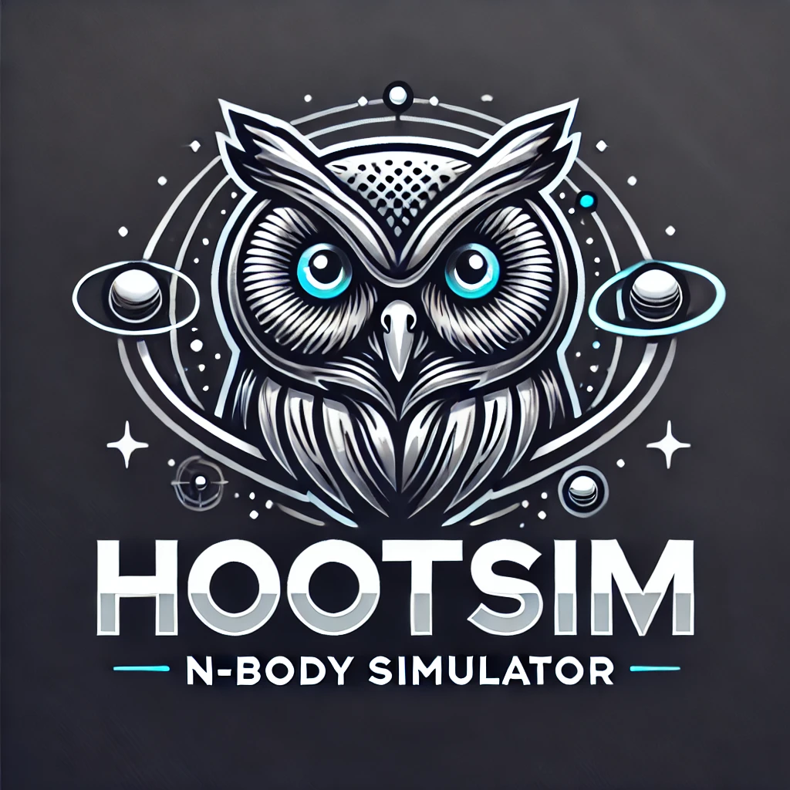

# HOOTSim: N-Body Simulator

## Overview ##
Welcome to HOOTSim, the N-Body Simulator crafted with precision and a touch of whimsy by John and Adam, two wise Owl gentlemen who are serious statisticians and coders but also like to have a good time. HOOTSim allows you to simulate the gravitational interactions of celestial bodies in a visually appealing and scientifically accurate manner.

## Features ##
Realistic N-Body Simulation: Experience the gravitational dance of celestial bodies as they interact with each other in a dynamic and accurate simulation.

# Customizable Parameters: Adjust parameters such as gravitational constants, initial positions, and velocities to create unique and captivating simulations.

# Stunning Visualization: HOOTSim provides a visually engaging representation of celestial bodies' movements, making it easy to observe and analyze complex interactions.

# Educational and Research-Friendly: Ideal for educational purposes and research in astrophysics, physics, and computer science.

# Developed by Owl Gentlemen: Crafted with care and expertise by John and Adam, two Owl gentlemen with a passion for statistics, coding, and a good time.

## Getting Started ##
## Setup
```
git clone https://github.com/jdinovi/HOOTSim.git
cd HOOTSim
export HOOTSIM_PATH=path/to/hootsim/directory  # we recommend adding this to your shell configuration script (i.e. .zshrc, .bashrc)
```

## Run The Simulator:
* `make build`
*  `./bin/HOOTSim`

## Run Test Suite:
* `make test`

## Run Code Coverages:
* `make coverage`

## Customization ##
# Adding Celestial Bodies
To add custom celestial bodies, modify the config.yaml file to include additional bodies with unique properties.

# Extending Functionality
For those eager to contribute or extend HOOTSim's functionality, please check the CONTRIBUTING.md file for guidelines.

# Contact
Have questions or suggestions? Reach out to John and Adam, the Owl gentlemen, at hootsim-owls@example.com.

Fly high with HOOTSim! 🦉✨

(Note: This README was not written by ChatGPT.)


# The below is stuff I kept from the original just in case it has to be here

[](https://github.com/jdinovi/HOOTSim/actions/workflows/test.yml) [](https://github.com/jdinovi/HOOTSim/actions/workflows/coverage.yml)


# HOOTSim
N-Body Simulator

<p align="center">
  
</p>

## Setup
```
git clone https://github.com/jdinovi/HOOTSim.git
cd HOOTSim
export HOOTSIM_PATH=path/to/hootsim/directory  # we recommend adding this to your shell configuration script (i.e. .zshrc, .bashrc)
```

## Run The Simulator:
* `make build`
*  `./bin/HOOTSim`

## Run Test Suite:
* `make test`

## Run Code Coverages:
* `make coverage`
